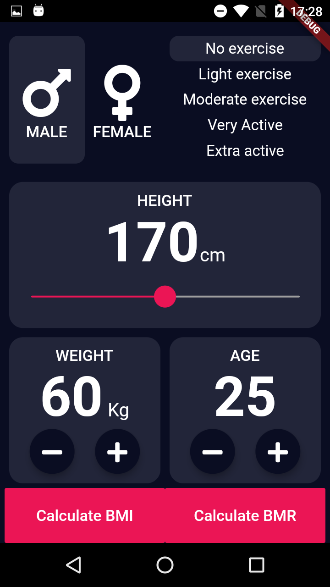
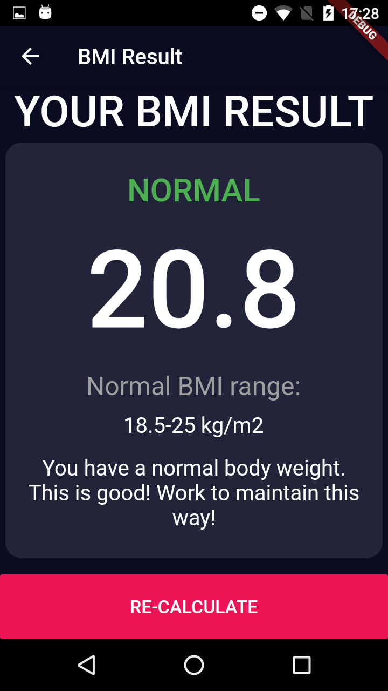
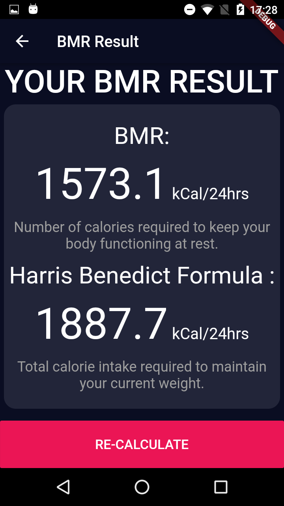

# bmi_bmr_calculator
One of my first mobile app project with Flutter.
It calculates the users Body Mass Index(BMI), Basal metabolic rate (BMR) and Harris Benedict Formula.  
Design inspired in Ruben Vaalt (https://dribbble.com/shots/4585382-Simple-BMI-Calculator). 

  
   
  

